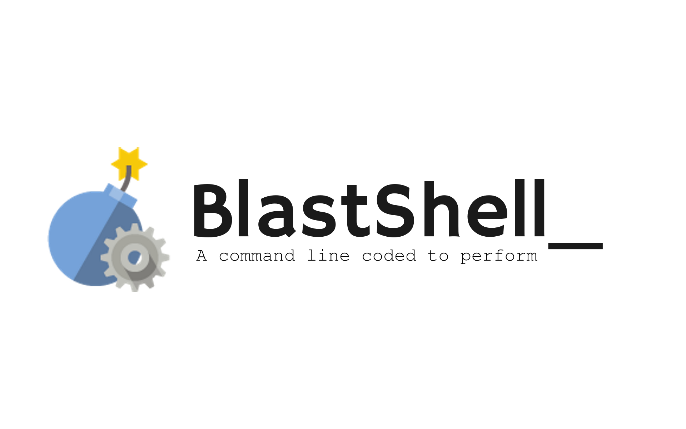

# **What's BlastShell?**
BlastShell is an interactive command line interface developed not only to solve complex mathematical problems, but also to perform everyday tasks with ease.

  

  Copyright (c) Anindya Shiddhartha. Licensed under MIT License. For more information, please read the [LICENSE](LICENSE) file.
  

### **_Installation Instructions_**

**For Windows users:**
 1. Download BlastShell from [here](https://github.com/shiddharth/BlastShell/archive/master.zip) and then extract it in a folder.
 2. Download FFmpeg from [here](https://ffmpeg.org/download.html) and install it.
 3. Go to the **Executables** folder in the extracted directory. Then run **bs-win.exe** and enjoy!

**For Linux users:**
 1. Download BlastShell from [here](https://github.com/shiddharth/BlastShell/archive/master.zip) and then extract it in a folder.
 2. Download and install FFmpeg from [here](https://ffmpeg.org).
 3. Navigate to the extracted directory, go to the **Executable** folder and right click on **bs-linux**. Then click on 'Properties', go to the 'Permissions' tab and click on 'Allow executing file as program'.
 4. Open a terminal window in current folder and type: 
 <code>./bs-linux</code>

That's it! You're ready to run BlastShell in any desired operating system.
  

### **_Contribution_**
As BlastShell is licensed under an open source license, you're free to get in to contributing
in it. Just grab your device, switch it on and hop in! The build files are already configured for you.